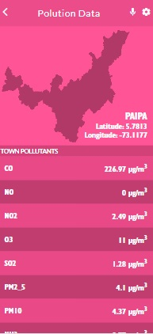

  <h1><b>Polution Metrics App</b></h1>
   
  
  

 

<!-- TABLE OF CONTENTS -->

# 📗 Table of Contents

- [📗 Table of Contents](#-table-of-contents)
- [📖 About ](#-about-)
  - [🛠 Built With ](#-built-with-)
    - [Tech Stack ](#tech-stack-)
    - [Key Features ](#key-features-)
  - [🚀 Live Demo ](#-live-demo-)
  - [💻 Getting Started ](#-getting-started-)
    - [Prerequisites](#prerequisites)
    - [Setup](#setup)
    - [Install](#install)
    - [Usage](#usage)
  - [👥 Authors ](#-authors-)
  - [🔭 Future Features ](#-future-features-)
  - [🤝 Contributing ](#-contributing-)
  - [⭐️ Show your support ](#️-show-your-support-)
  - [🙏 Acknowledgments ](#-acknowledgments-)
  - [❓ FAQ (OPTIONAL) ](#-faq-optional-)
  - [📝 License ](#-license-)

<!-- PROJECT DESCRIPTION -->

# 📖 About 

**Polution Metrics App** is a website that provides information about some pollution metrics for all the towns in the state of Boyacá in Colombia.

## 🛠 Built With 

### Tech Stack 

  
Client

  <ul>
    <li><a href="https://reactjs.org/">React</a></li>
  </ul>
  <ul>
    <li><a href="https://developer.mozilla.org/en-US/docs/Web/HTML">HTML</a></li>
  </ul>
  <ul>
    <li><a href="https://developer.mozilla.org/en-US/docs/Web/CSS">CSS</a></li>
  </ul>

<!-- Features -->

### Key Features 

- **Single page application**

(<a href="#readme-top">back to top</a>)

<!-- LIVE DEMO -->

## 🚀 Live Demo 

- [Coming soon](https://dfsalam.github.io/spacehub/build/index.html)

(<a href="#readme-top">back to top</a>)

<!-- GETTING STARTED -->

## 💻 Getting Started 

To get a local copy up and running, follow these steps.

### Prerequisites

In order to run this project you need:

- A working computer
- Connection to internet

### Setup

Clone this repository to your desired folder:

- git clone https://github.com/dfsalam/spacehub.git

### Install

- npm install

### Usage

To run the project, execute the following command:

- npm start

(<a href="#readme-top">back to top</a>)

<!-- AUTHOR -->

## 👥 Authors 

👤 **Diego Salamanca**

- GitHub: [@dfsalam](https://github.com/dfsalam)

(<a href="#readme-top">back to top</a>)

<!-- FUTURE FEATURES -->

## 🔭 Future Features 

- [ ] **Animations and transitions**

(<a href="#readme-top">back to top</a>)

<!-- CONTRIBUTING -->

## 🤠Contributing 

Contributions, issues, and feature requests are welcome!

Feel free to check the [issues page](https://github.com/dfsalam/metrics-webapp/issues).

(<a href="#readme-top">back to top</a>)

<!-- SUPPORT -->

## ⭐️ Show your support 

If you like this project feel free to fork it and use it as you need.

(<a href="#readme-top">back to top</a>)

<!-- ACKNOWLEDGEMENTS -->

## 🙠Acknowledgments 

I would like to thank Microverse for the information provided to build this project.

Original design idea by 
<a href="https://www.behance.net/sakwadesignstudio" >Nelson Sakwa on Behance.</a>

(<a href="#readme-top">back to top</a>)

<!-- FAQ (optional) -->

## ❓ FAQ (OPTIONAL) 

- **Can I use the project for any purpose?**

  - Yes, you can use this files for anything you need

- **Is the information saved in any database?**

  - No, all data is saved in the involvement api

(<a href="#readme-top">back to top</a>)

<!-- LICENSE -->

## 📠License 

This project is [MIT](./MIT.md) licensed

(<a href="#readme-top">back to top</a>)

